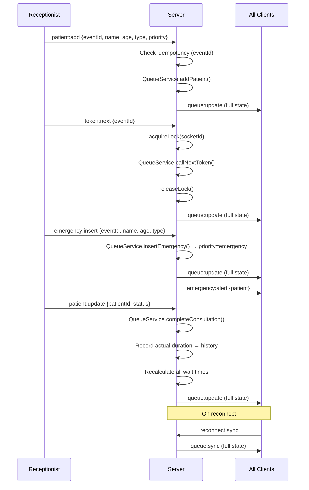

# Queue Cure '26

> Real-time patient queue management system for modern clinics.

---

## Overview

Queue Cure '26 eliminates the chaos of clinic waiting rooms by providing a live, intelligent token management system. Receptionists see the full queue in real time; patients see their position, estimated wait time, and when they'll be called — all without refreshing the page.

---

## Features

### Receptionist Dashboard
- Add patients (name, age, consultation type, priority, notes, doctor assignment)
- Auto-generated sequential token numbers
- One-click "Call Next Token" with concurrency protection
- Set default consultation duration; override per patient
- Mark patients: In Consultation / Completed / No Show / Cancelled
- Emergency patient insertion (jumps to front of queue)
- Manual reorder within priority tier (↑ / ↓ buttons)
- Pause / Resume queue with optional reason message
- Overtime alert — live badge when current consultation exceeds estimated duration
- Multi-doctor mode — add doctors, assign patients, filter by doctor
- Live queue statistics (waiting, average wait, completed today)
- Real-time activity feed
- Analytics tab — hourly throughput, consultation type breakdown
- End-of-day summary modal
- Search + filter by priority tier and doctor
- Sound announcements via Web Speech API (mutable per session)
- Optimistic UI + toast notifications

### Waiting Room Display
- Large "Now Serving" token number with pulse animation
- Pause banner — amber alert bar when receptionist pauses the queue
- Token lookup by number (shows position, estimated wait, call time)
- Live progress bar for today's queue
- Full upcoming patients list with estimated wait times
- TV Display Mode for large screens
- Connection status indicator (Live / Reconnecting…)

### Socket Event Diagram
- Interactive in-app diagram of all 14 socket events (accessible via 🔌 tab)
- Client → Server and Server → Client event reference with payloads
- Printable / exportable for hackathon submission

### Smart Wait Time
- Calculated from real historical consultation data
- Broken down by consultation type (general, specialist, follow-up, emergency)
- Recalculates on every queue change
- Accounts for current consultation's elapsed time

### Priority Queue
| Priority | Symbol | Placement |
|---|---|---|
| Emergency | 🚨 | Always first |
| Senior | ⭐ | Before normal |
| Normal | 👤 | FIFO within tier |

---

## Architecture

```
queue-cure-26/
├── client/                    # React + TypeScript + Vite
│   └── src/
│       ├── features/
│       │   ├── receptionist/  # Receptionist dashboard
│       │   └── waiting-room/  # Patient display
│       ├── components/ui/     # Shared components
│       ├── hooks/             # useSocket (singleton)
│       ├── store/             # Zustand global state
│       ├── types/             # Shared TypeScript types
│       └── utils/             # Formatting helpers
└── server/                    # Node.js + Express + Socket.IO
    └── src/
        ├── services/          # QueueService (business logic)
        ├── socket/            # Socket event handlers
        ├── controllers/       # REST controllers
        ├── middleware/        # Validation
        └── types/             # Server types
```

---

## Socket Flow



---

## Setup Instructions

### Prerequisites
- Node.js 18+
- npm 9+

### Install

```bash
# From repo root
cd server && npm install
cd ../client && npm install
```

### Run (two terminals)

**Terminal 1 — Server:**
```bash
cd server
npm run dev
# Listens on http://localhost:3001
```

**Terminal 2 — Client:**
```bash
cd client
npm run dev
# Opens http://localhost:5173
```

### Screens
- `http://localhost:5173` — defaults to Receptionist Dashboard
- `http://localhost:5173/#waiting` — Waiting Room Display
- `http://localhost:5173/#diagram` — Socket Event Diagram (printable)
- Switch between screens with the floating tab bar at the bottom

---

## Edge Cases Handled

| Scenario | Handling |
|---|---|
| Double-click Call Next | Server-side queue lock per socket, auto-releases after 5s |
| Two receptionists call simultaneously | Only first lock holder proceeds; second gets rejection |
| Duplicate socket events | `eventId` (UUID) idempotency map on server |
| Network disconnect | Zustand shows "Reconnecting…" badge; resync on reconnect |
| Browser refresh | `reconnect:sync` event sends full state on every connect |
| Empty queue | "Call Next" is disabled; UI shows empty state |
| Emergency during consultation | Inserted at head; current consultation continues |
| Zero average duration | Falls back to `defaultConsultationDuration` (10 min) |
| Average duration = 0 | Per-type defaults used (general=10, specialist=20, etc.) |
| Patient no-show | Removed from wait calculation; history retained |
| Long consultation overrun | Remaining time clamped to 0 in wait calculation |
| Duplicate patient names | Allowed — distinguished by unique token number |

---

## Technical Decisions

### Why in-memory store (not MongoDB)?
For a hackathon context the in-memory `QueueService` class eliminates setup friction. It's architecturally identical to a MongoDB-backed version — just swap `this.state` persistence to a Mongoose model. The service layer is already separated.

### Why Zustand over Redux?
Zustand gives Redux-level capability with 80% less boilerplate. A single `syncState` action replaces the entire reducer for our use case (full-state broadcast from server).

### Why full-state broadcast over delta events?
Queue operations are so infrequent (seconds apart) that diff-patch complexity isn't justified. Sending full state on every event guarantees clients never get out of sync, handles late joiners, and makes reconnect trivial.

### Concurrency via lock + idempotency
Two independent mechanisms: server-side mutex prevents dual "call next" races; UUID-keyed idempotency map prevents duplicate processing of retried network events.

---

## Scalability Discussion

For production at scale (multi-clinic, thousands of concurrent patients):

1. **Redis pub/sub** — Replace in-memory state with Redis; Socket.IO `socket.io-redis` adapter fans events to all server instances
2. **MongoDB** — Persist queue state, consultation history, analytics
3. **Horizontal scaling** — Stateless Express servers behind a load balancer; Redis holds truth
4. **Rate limiting** — Add `express-rate-limit` on REST + Socket.IO middleware for event throttling
5. **Analytics DB** — Time-series store (InfluxDB/TimescaleDB) for peak-hour and wait-time trends
6. **Multi-clinic** — Namespace Socket.IO by clinic ID; separate Zustand slices or stores per clinic

---

## Submission Artifacts

| Artifact | Location |
|---|---|
| Prototype | `npm run dev` in `/client` + `/server` |
| Socket event diagram | In-app at `/#diagram` or `THOUGHT_PROCESS.md` |
| Thought process sheet | `THOUGHT_PROCESS.md` at repo root |
| GitHub repo | This repository |

---

## Future Roadmap

- [ ] SMS/WhatsApp notifications when token is called
- [ ] Patient self-registration via QR code
- [ ] Doctor-facing view (different from receptionist)
- [ ] Appointment scheduling integration
- [ ] MongoDB persistence layer
- [ ] Multi-clinic support with namespaced sockets
- [ ] Estimated wait time via ML (XGBoost on consultation history)
- [ ] Export to PDF/CSV
